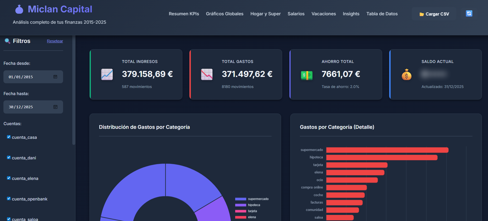
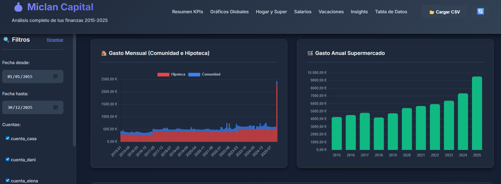

# 💰 Miclan Capital

Dashboard interactivo para análisis de movimientos bancarios con visualizaciones avanzadas, filtros dinámicos y métricas financieras.

## �️ Vista Previa




## �🚀 Características

### 📊 Visualizaciones
- **Distribución de gastos por categoría** (gráfico circular)
- **Ingresos vs Gastos por categoría** (gráfico de barras)
- **Evolución temporal** de ingresos y gastos (gráfico de líneas)
- **Ahorro mensual** con indicadores positivos/negativos
- **Saldo por cuenta** y evolución temporal
- **Evolución del saldo** de todas las cuentas

### 🔍 Filtros Interactivos
- Rango de fechas personalizado
- Selección múltiple de cuentas
- Filtro por categorías
- Tipo de movimiento (Todos/Ingresos/Gastos)

### 📈 KPIs Principales
- Total de ingresos
- Total de gastos
- Ahorro total y tasa de ahorro
- Saldo actual de cuentas

### 💡 Insights Automáticos
- Top 10 gastos más grandes
- Gastos recurrentes identificados
- Alertas de gastos inusuales
- Detección de ahorro negativo

### 📋 Datos y Privacidad
- **Carga dinámica de CSV**: Botón para cargar cualquier archivo local de forma interactiva.
- **Fallback automático**: Si no se encuentra el archivo configurado, carga automáticamente `datos_ejemplo.csv`.
- **Modo Privacidad**: El saldo actual se muestra ofuscado (blur) por defecto; haz clic para mostrarlo/ocultarlo.
- **Búsqueda y Paginación**: Filtros en tiempo real y 50 registros por página.
- **Exportación**: Descarga la vista actual a un nuevo archivo CSV.

## 🛠️ Tecnologías

- **HTML5** - Estructura semántica
- **CSS3** - Diseño moderno con dark mode
- **JavaScript (ES6+)** - Lógica de aplicación
- **Chart.js 4.4** - Gráficos interactivos
- **PapaParse 5.4** - Procesamiento de CSV

## 📦 Instalación

### Opción 1: Servidor Local Simple

1. Abre una terminal en la carpeta del proyecto
2. Ejecuta un servidor HTTP local:

**Python 3:**
```bash
python -m http.server 8000
```

**Node.js (si tienes http-server instalado):**
```bash
npx http-server -p 8000
```

**PowerShell (Windows):**
```powershell
python -m http.server 8000
```

3. Abre tu navegador en: `http://localhost:8000`

### Opción 2: Docker (Recomendado) 🐳

Si tienes Docker instalado, esta es la forma más limpia de usar la aplicación.

1. **Construir y arrancar:**
```bash
docker-compose up -d
```

2. **Abrir:**
Visita `http://localhost:8000`

**Ventaja:** El contenedor está configurado para leer el archivo CSV de tu carpeta local. 

### Opción 3: Uso con Datos de Ejemplo
Si simplemente quieres probar la aplicación sin configurar nada, el dashboard cargará automáticamente el archivo `datos_ejemplo.csv` incluido en el repositorio si no detecta tu archivo personal.


### Opción 3: Abrir directamente

⚠️ **Nota**: Algunos navegadores bloquean la carga de archivos locales por seguridad (CORS). Si el CSV no carga, usa la Opción 1 o 2.

## 📁 Estructura del Proyecto

```
dashboard_cuentas/
│
├── index.html                          # Página principal
├── styles.css                          # Estilos del dashboard
├── app.js                              # Lógica de la aplicación
├── datos_ejemplo.csv                   # Datos de prueba para Git/Demostración
├── Cuentas_casa+elena2015-2025...csv   # Tu archivo real (ignorar en Git)
├── Vacaciones.csv                      # Datos de vacaciones (Año;Destino;Coste)
└── README.md                           # Este archivo
```

## 🎨 Personalización

### Cambiar Colores

Edita las variables CSS en `styles.css`:

```css
:root {
    --primary-color: #6366f1;      /* Color principal */
    --success-color: #10b981;      /* Color de ingresos */
    --danger-color: #ef4444;       /* Color de gastos */
    /* ... más colores ... */
}
```

### Ajustar Configuración

Edita las constantes en `app.js`:

```javascript
const CONFIG = {
    CSV_FILE: 'tu-archivo.csv',    // Nombre del CSV
    ROWS_PER_PAGE: 50,              // Filas por página
    TOP_CATEGORIES: 10,             // Categorías a mostrar
    // ... más opciones ...
};
```

## 📊 Formato del CSV

El dashboard espera un CSV con las siguientes columnas (separadas por `;`):

| Columna | Descripción | Ejemplo |
|---------|-------------|---------|
| Fecha contable | Fecha del movimiento | 15/01/2025 |
| Fecha valor | Fecha valor | 15/01/2025 |
| Concepto | Descripción breve | Compra supermercado |
| Importe | Cantidad (negativo=gasto) | -45,50 |
| Moneda | Moneda | EUR |
| Saldo | Saldo después del movimiento | 1.234,56 |
| Concepto ampliado | Descripción detallada | Mercadona... |
| Categoria | Categoría del gasto | supermercado |
| Subcategoria | Subcategoría | alimentación |
| cuenta | Nombre de la cuenta | cuenta_casa |

**Formato de números**: Europeo (punto para miles, coma para decimales)
- Ejemplo: `1.234,56` = mil doscientos treinta y cuatro euros con 56 céntimos

## 🔧 Solución de Problemas

### El CSV no se carga

### El CSV no se carga automáticamente

1. **Usa el botón "Cargar CSV"**: Ahora puedes seleccionar manualmente tu archivo desde el encabezado.
2. **Verifica el nombre**: Si quieres carga automática, el archivo debe coincidir con `CONFIG.CSV_FILE` en `app.js`.
3. **Usa un servidor local**: (ver Opción 1 de instalación) para evitar bloqueos de seguridad (CORS).
4. **Revisa la consola del navegador**: (F12) para ver errores detallados.
5. **Verifica el delimitador**: Asegúrate de que usa `;` como separador.

### Los números no se muestran correctamente

- Asegúrate de que el CSV usa formato europeo (`,` para decimales)
- Verifica que no hay espacios extra en los números

### Los gráficos no aparecen

1. Verifica que tienes conexión a internet (Chart.js se carga desde CDN)
2. Revisa la consola del navegador para errores
3. Asegúrate de que el CSV tiene datos válidos

## 📱 Responsive

El dashboard es completamente responsive y se adapta a:
- 💻 Desktop (1920px+)
- 💻 Laptop (1200px - 1920px)
- 📱 Tablet (768px - 1200px)
- 📱 Mobile (< 768px)


## 📄 Licencia

Proyecto personal - Uso libre

## 👨‍💻 Autor

Desarrollado para análisis financiero personal

---

**¿Necesitas ayuda?** Revisa la consola del navegador (F12) para ver mensajes de error detallados.
